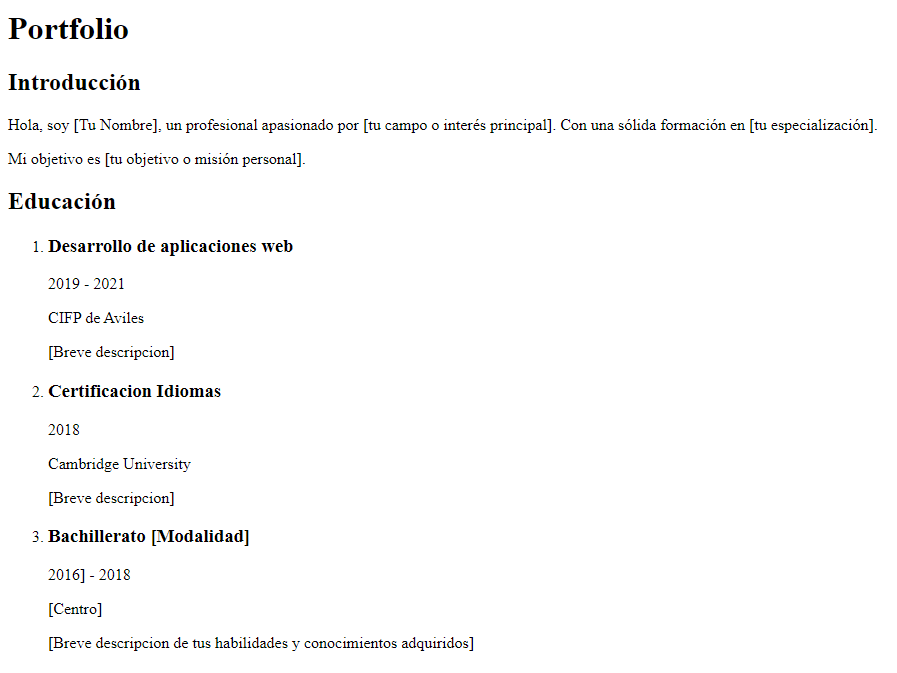
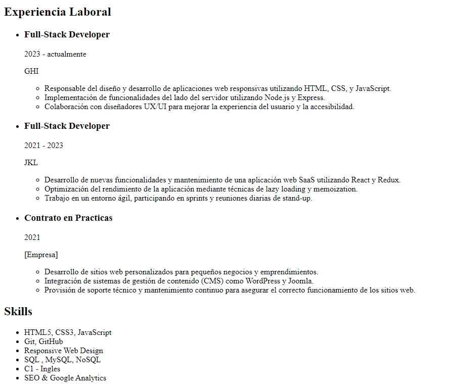

# Práctica 2: Página de Biografía Personal

## Formato
El documento html sera entregado en la carpeta correspondiente a la practica con el nombre index-X.html donde X es el numero de practica

## Descripción
Crear una página web que presente una biografía personal, organizada con encabezados, párrafos, y listas.

## Instrucciones

1. **Título de la Página:**
   - Crea el titulo principal de la pagina. "Portfolio".

2. **Sección de Introducción:**
   - Crear una sección para la introducción con un encabezado , y un párrafo que describa quién eres.

3. **Sección de Educación:**
   - Crear una sección para la educación con un encabezado .
   - Incluir una lista ordenada que detalle tus logros educativos.
   - Cada logro educativo debe tener un encabezado  y un párrafo descriptivo.

4. **Sección de Experiencia Laboral:**
   - Crear una sección para la experiencia laboral con un encabezado.
   - Incluir una lista desordenada  que detalle tus trabajos anteriores.
   - Cada trabajo debe tener un encabezado  y una lista anidada con responsabilidades y logros.

5. **Sección de Habilidades:**
   - Crear una sección para las habilidades con un encabezado.
   - Incluir una lista desordenada que detalle tus habilidades.

## Resultado final

</img>
</img>

