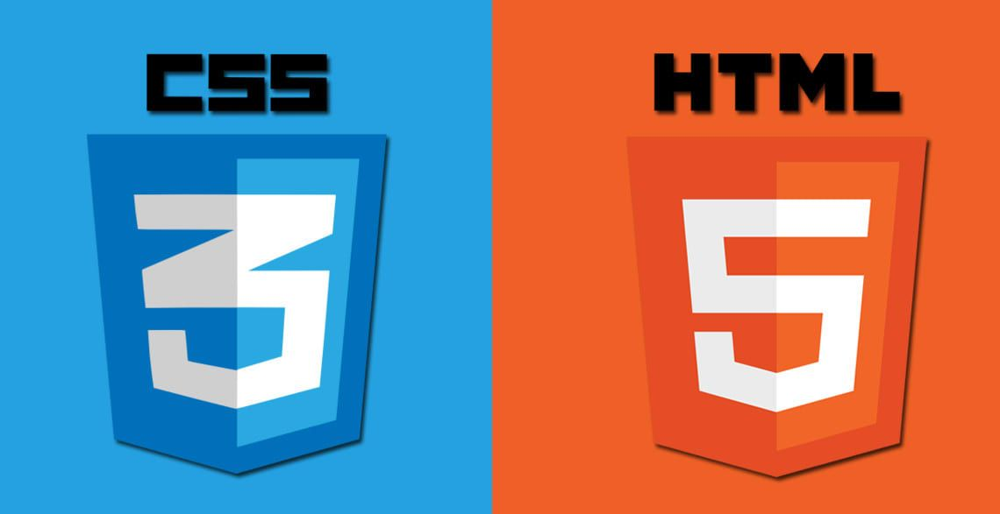

</img>
# CURSO DE HTML5 Y CSS3

En este curso se transmitiran los conocimientos necesario para crear una web con html y css, aprenderas desde lo mas básico a lo más avanzado.

En este repositorio encontraras teoria , ejercicios y proyectos.

## Contenido

### 1. INTRODUCCION 
- [Entendidendo la web](1-Introducción/1-entendiendo-la-web.md)
- [Entendidendo HTML y CSS](1-Introducción/2-entendiendo-html-css.md)
- [Editor de Codigo](1-Introducción/3-editor-codigo.md)

